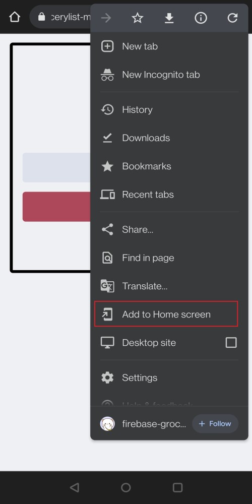

## Grocery List App

Grocery list mobile-like app to add and remove grocery list.

Built with HTML, CSS, Vanilla JavaScript, and Firebase. 

**Best used with smartphones.** See below on how to add it like a mobile application. 

 

## Installation and Setup Instructions
No required NPM packages required as it is built with HTML, CSS, and Vanilla JavaScript.

- [Visit App](https://firebase-grocerylist-mobile.netlify.app/)

## Reflection
A guided project under Scrimba's Frontend Developer Career Path Module 3: Making Websites Interactive. Learned Firebase such as the following:
 - Basic setup code to connect to Firebase
 - Firebase just as any other database handles the automatic creation of unique IDs
 - `ref` is used to point to a specific database you created on Firebase
 - `onValue` callback function runs everytime there is a change in the database
 - `push` method creates a record on the firebase database
 - `remove` methods deletes a record on the firebase database

Tweaked some default designs and added features such as:
 - Error message when input is empty.
 - Added two tap to avoid accidentally deleting items
 - Added a desktop version
